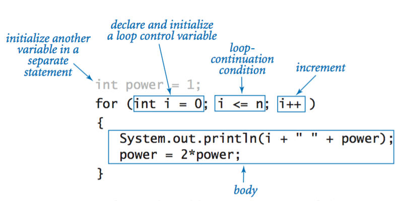

## The statements for loops provided in JavaScript are:

### + For statement  
A for loop repeats until a specified condition evaluates to false. The JavaScript for loop is similar to the Java and C for loop.

A for statement looks as follows:

When a for loop executes, the following occurs:

1. The initializing expression initialExpression, if any, is executed. This expression usually initializes one or more loop counters, but the syntax allows an expression of any degree of complexity. This expression can also declare variables.
2. The conditionExpression expression is evaluated. If the value of conditionExpression is true, the loop statements execute. If the value of condition is false, the for loop terminates. (If the condition expression is omitted entirely, the condition is assumed to be true.)
3. The statement executes. To execute multiple statements, use a block statement ({ ... }) to group those statements.

4. If present, the update expression incrementExpression is executed.

#### Example
In the example below, the function contains a for statement that counts the number of selected options in a scrolling list (a <select> element that allows multiple selections). The for statement declares the variable i and initializes it to 0. It checks that i is less than the number of options in the <select> element, performs the succeeding if statement, and increments i by after each pass through the loop.

###  while statement
A while statement executes its statements as long as a specified condition evaluates to true. A while statement looks as follows:

If the *condition *becomes false, statement within the loop stops executing and control passes to the statement following the loop.

The condition test occurs before statement in the loop is executed. If the condition returns true, statement is executed and the condition is tested again. If the condition returns false, execution stops, and control is passed to the statement following while.

To execute multiple statements, use a block statement ({ ... }) to group those statements.

