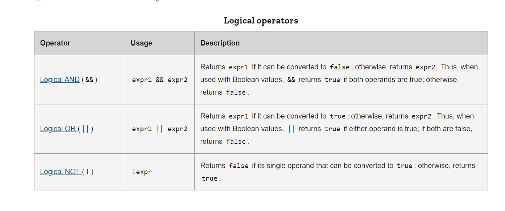

# Operators
JavaScript has the following types of operators. This section describes the operators and contains information about operator precedence.

### 1- Assignment operators
 ## 	x = y

### 2- Comparison operators
## x += y

### 3- Arithmetic operators
## 	x -= y

### 4- Bitwise operators

### 5- Logical operators

### 6- String operators

### 7- Conditional (ternary) operator

### 8- Comma operator

### 9- Unary operators

### 10- Relational operators

# Logical operators
### Logical operators are typically used with Boolean (logical) values; when they are, they return a Boolean value. However, the && and || operators actually return the value of one of the specified operands, so if these operators are used with non-Boolean values, they may return a non-Boolean value. The logical operators are described in the following table.

# 

# Functions

### Functions are one of the fundamental building blocks in JavaScript. A function in JavaScript is similar to a procedure—a set of statements that performs a task or calculates a value, but for a procedure to qualify as a function, it should take some input and return an output where there is some obvious relationship between the input and the output. To use a function, you must define it somewhere in the scope from which you wish to call it.

# Defining functions

### A function definition (also called a function declaration, or function statement) consists of the function keyword, followed by:

### The name of the function.
### A list of parameters to the function, enclosed in parentheses and separated by commas.
### The JavaScript statements that define the function, enclosed in curly brackets, {...}.
### For example, the following code defines a simple function named square:
### function square(number) {
### return number * number;
}

# Calling functions
### Defining a function does not execute it. Defining it names the function and specifies what to do when the function is called.

### Calling the function actually performs the specified actions with the indicated parameters. For example, if you define the function square, you could call it as follows:

# Function scope
### Variables defined inside a function cannot be accessed from anywhere outside the function, because the variable is defined only in the scope of the function. However, a function can access all variables and functions defined inside the scope in which it is defined.

### In other words, a function defined in the global scope can access all variables defined in the global scope. A function defined inside another function can also access all variables defined in its parent function, and any other variables to which the parent function has access.